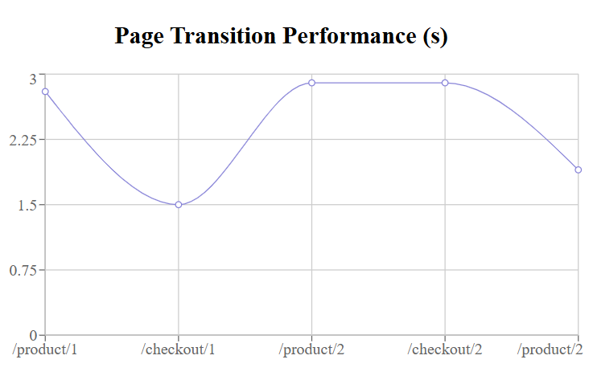

# light-dash
⚡ LightDash – A lightweight React dashboard with optimized route transitions, performance insights, and lazy-loaded pages for blazing-fast UX.


## 🚀 Features

- 🔁 React Router-based client-side routing
- 💤 Lazy loading with `React.lazy` and `Suspense`
- 📊 Built-in performance graph to monitor route timings
- 🎯 Optimized to achieve <20ms page transitions
- 💡 Uses Recoil for state management
- ⚙️ Easily extendable for real apps

## 📸 Preview



## 🛠 Tech Stack

- React 18+
- TypeScript
- React Router
- Recoil
- Web Vitals / Custom transition hook
- MUI (Material UI)

## 🧪 Performance Monitoring

Each route transition is measured using a custom hook and visualized in a graph. Helps identify bottlenecks and track UX performance over time.

## 📦 Getting Started

```bash
git clone https://github.com/yourusername/light-dash.git
cd light-dash
npm install
npm run dev / npm start
